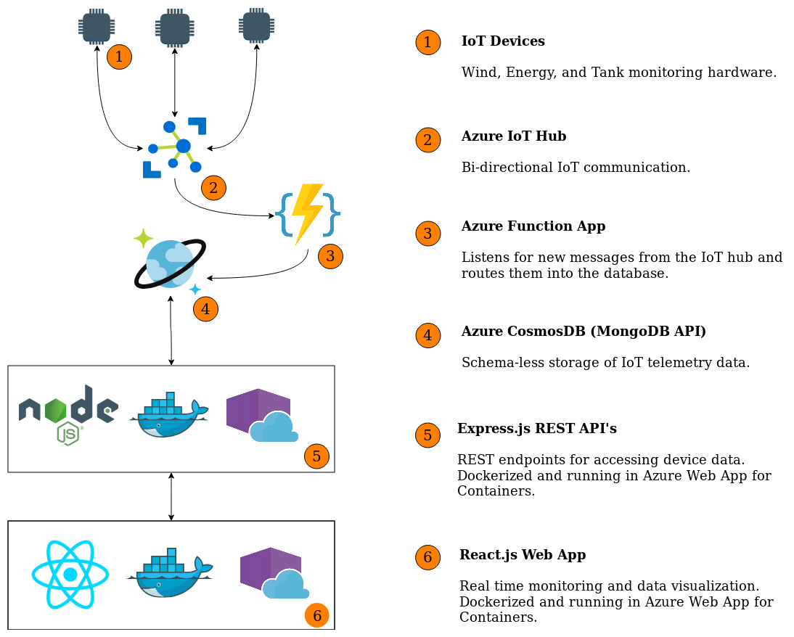

<h1 align="center">Iced IoT</h1>

      

  <strong>IoT Device Monitoring and Orchestration</strong>

  A refreshing IoT platform!

 

  <!-- Dependencies -->
  
  <!-- Size -->
  
  

  <h3>
    <a href="https://icediot.com/">
      WebApp
    </a>
     | 
    <a href="https://icediot.com/about">
      About
    </a>
  </h3>

  A personal project built by
  <a href="https://github.com/agmoss">Andrew Moss</a>

## Table of Contents
- [Features](#features)
- [Design Philosophy](#design-philosophy)
- [Platform Architecture](#platform-architecture)
- [Associated Repo's](#associated-repo's)
- [Tools](#tools)

## Features
- __RealTime Device Information:__ Accurate and up to date info and analytics
- __Scalable:__ Built with Docker, CosmosDB, and NGINX for scalability and resilience
- __Modular:__ Microservices architecture
- __Current:__ Built with modern cloud tooling and design patterns

## Design Philosophy
Iced IoT is a low overhead and robust IoT solution. The user can add facilities and devices of any variety on the IoT hub with minimal configuration. Added devices are instantly visible on the web app for tracking and analytics. 

The platform is a series of microservices that can be independently scaled and maintained. All application services are dockerized and running as container instances in Azure. The entire platform is written in JavaScript with heavy use of non-blocking async code. The React front end is an MVC style app with presentation and container components. 

## Plaftorm Architecture

   

 

## Associated Repo's
- [Express API's](https://github.com/agmoss/iotsimbackend)
- [Azure Function App](https://github.com/agmoss/IotHub_EventHub_MongoDB)
- [IoT Devices](https://github.com/agmoss/iot-simulation)

## Tools

- [React](https://reactjs.org/)
- [NGINX](https://www.nginx.com/)
- [Docker](https://www.docker.com/)
- [Azure IoT Hub](https://azure.microsoft.com/en-ca/services/iot-hub/)
- [Azure Functions](https://docs.microsoft.com/en-us/azure/azure-functions/)
- [CosmosDB](https://azure.microsoft.com/en-ca/services/cosmos-db/)
- [Node.js](https://nodejs.org/en/)
- [Express.js](https://expressjs.com/)
